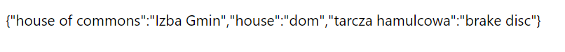

# Google Words Chrome Extension v1.0

Program, allows you to quickly add a word from a [google translator](https://translate.google.com/) to the temporary memory.

Current functionalities:
* add a word
* delete a word

Choosing "options" allows us to display all added words as JSON

