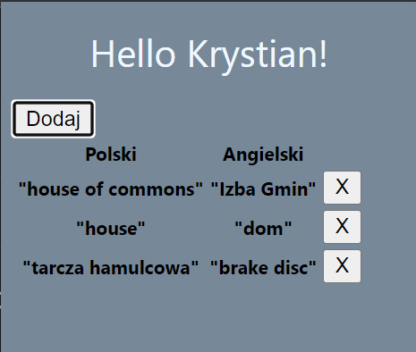

# Google Words Chrome Extension v1.0

Program, allows you to quickly add a word from a [google translator](https://translate.google.com/) to the temporary memory.

Current functionalities:
* add a word
* delete a word

Choosing "options" allows us to display all added words as JSON

The program aims to quickly migrate data stored in chrome extension to [RANDOM WORD](https://github.com/Krystiankr/PYQT5-Random-Words) program

to load the extension, download the zip, unpack, then go chrome://extensions/, enable developer settings and load the folder